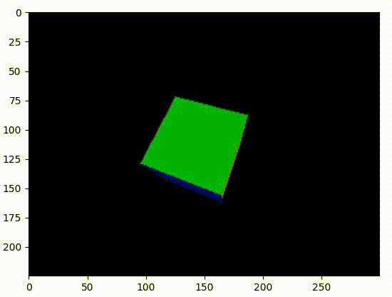
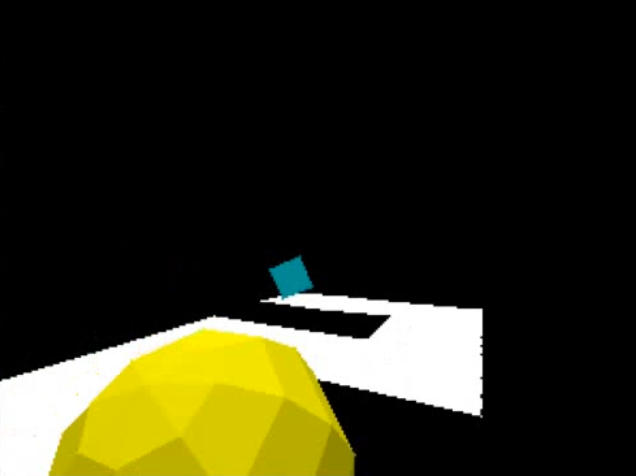

# Python 3D Renderer

This is a simple 3D renderer build with Python.

## Overview

This project is a real-time 3D renderer implemented in Python. It features a custom rasterization pipeline with shadow mapping, a movable camera, and interactive rendering using Matplotlib. The renderer supports near-plane clipping, Z-buffering, and flat shading to achieve realistic depth and lighting effects.

## Features

- **Z-Buffering**: Ensures correct depth sorting for overlapping objects.
- **Flat Shading**: Computes lighting per polygon for a classic low-poly aesthetic.
- **Near-Plane Clipping**: Avoids rendering artifacts by clipping geometry behind the camera.
- **Parallel Projection Mode**: Allows toggling between perspective and orthographic views.
- **Interactive Camera Controls**:
  - `WASD` for movement
  - Arrow keys for rotation
  - `E/Q` to move up/down

## Dependencies

```sh
pip install numpy matplotlib numba
```

## Usage

1. Clone the repository

```
git clone https://github.com/your-repo/3d-renderer.git
```

2. Import `Camera`, `Screen`, `Object`, and `Operation`

```py
from camera import Camera
from object import Object
from screen import Screen
from operation import Operation

object = Object() # This is a plane
object.add_vertices(vertices=[
    [0, 0, 0], [1, 0, 0],
    [1, 1, 0], [0, 1, 0],
])
object.add_planes(planes=[
    [0, 1, 2], [2, 3, 0]
], color=[0, 255, 255])
```

## Demo

Single Cube Rotation



A simple game rendered by Python 3D Renderer.

